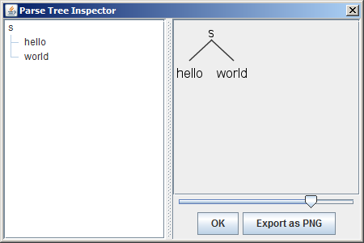

# 入门

先看下面这段用于识别像hello world那样的短语的简单文法：

```
grammar Hello;               // 定义文法的名字

s  : 'hello' ID ;            // 匹配关键字hello和标志符
ID : [a-z]+ ;                // 标志符由小写字母组成
WS : [ \t\r\n]+ -> skip ;    // 跳过空格、制表符、回车符和换行符
```

把以上文法保存为Hello.g，然后执行以下命令来生成识别器：

```
$ ./antlr Hello.g
```

该命令会在相同目录下生成后缀名为tokens、interp和java的8个文件：

```
$ ls Hello*
Hello.g       Hello.tokens            HelloLexer.interp  HelloLexer.tokens   HelloParser.java
Hello.interp  HelloBaseListener.java  HelloLexer.java    HelloListener.java
```

现在开始准备编译由ANTLR生成的Java代码。先写个脚本把编译命令包装起来：

```
#!/bin/sh
javac -cp antlr-4.7.1-complete.jar $*
```

把它保存为compile文件，然后你就可以用以下命令编译代码：

```
$ ./compile Hello*.java
```

到此，我们已经有一个可以被执行的识别器，只缺一个主程序去触发语言识别。

ANTLR运行库有提供一个称之为TestRig的测试工具，可以让你不创建主程序就能测试文法。TestRig使用Java反射调用编译后的识别器，它能显示关于识别器如何匹配输入的大量信息。

同样地，创建一个脚本grun来简化以后的打字数：

```
#!/bin/sh
java -cp .:$PWD/antlr-4.7.1-complete.jar org.antlr.v4.gui.TestRig $*
```

现在，让我们来打印出识别期间创建的那些记号（记号是指像关键字hello和标识符world那样的词汇符号）：

```
$ ./grun Hello s -tokens  # Hello是文法的名字。s是开始的规则名字。
```

敲入上述命令并按回车，接着输入以下内容：

```
hello world  # 输入并按回车
EOF          # Linux系统输入Ctrl+D或Windows系统输入Ctrl+Z并按回车
```

TestRig会打印出记号的列表，每一行输出表示一个记号以及它的相关信息：

```
[@0,0:4='hello',<1>,1:0]
[@1,6:10='world',<2>,1:6]
[@2,13:12='<EOF>',<-1>,2:0]
```

这里详细讲解下[@1,6:10='world',<2>,1:6]的意义。@1表示记号索引（从0开始计数）；6:10表示记号开始与结束的位置（从0开始计数）；<2>表示记号类型，具体数值和类型存储在后缀名为tokens的文件中；最后的1:6表示记号在第一行（从1开始计数），从第6个字符开始（从0开始计数，制表符作为单个字符计算）。

以LISP风格的文本形式查看记号：

```
$ ./grun Hello s -tree
```

它会输出如下形式的记号：

```
(s hello world)
```

还可以以可视化的方式查看语法分析树：

```
$ ./grun Hello s -gui
```



以下是TestRig可用的所有参数：

* -tokens 打印出记号流。
* -tree 以LISP风格的文本形式打印出语法分析树。
* -gui 在对话框中可视化地显示语法分析树。
* -ps file.ps 在PostScript中生成一个可视化的语法分析树表示，并把它存储在file.ps文件中。
* -encoding encodingname 指定输入文件的编码。
* -trace 在进入/退出规则前打印规则名字和当前的记号。
* -diagnostics 分析时打开诊断消息。此生成消息仅用于异常情况，如二义性输入短语。
* -SLL 使用更快但稍弱的分析策略。
